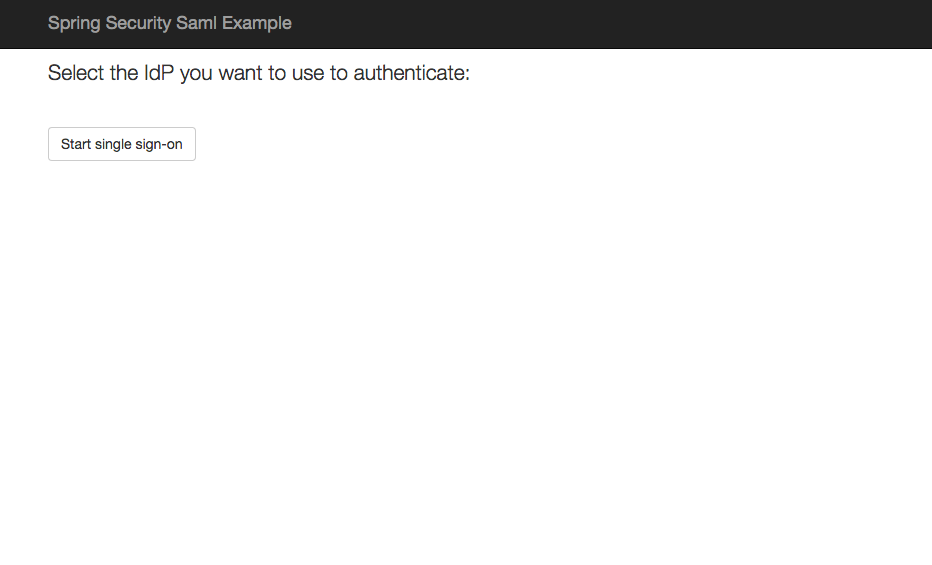

# Introduction 

This is an example of a SAML SP login Application using the Spring Security SAML framework 

The setup for this app refers to the Spring Security SAML (Java) tutorial at : http://developer.okta.com/docs/guides/spring_security_saml.html


# Requirement 

Please make sure the following are installed before starting installation:

[Java 1.6+ SDK](http://www.oracle.com/technetwork/java/javase/overview/index.html)

[Apache Maven](https://maven.apache.org/download.cgi)
# Installation Setup

This section covers what you need to do to install and configure Tomcat from scratch on Mac OS X. If you already have Tomcat on your system, you can skip to Step 2 below.

How to install the Spring Security SAML sample Okta application on Mac OS X:

1. Complete Step one in the "Installing the Spring Security SAML sample application " at  
	:http://developer.okta.com/docs/guides/spring_security_saml.html#installing-the-spring-security-SAML-sample-application

2. ##Downloading the Spring SAML Extension
	
	- Download the extension from  https://github.com/spring-projects/spring-security-saml

	- Use 'git clone' to clone the repository locally
	
3. Downloading sample application 
	
	- Use 'git clone' to clone the repository locally
	
	- Use the command below to copy the sample Okta application into the Extension's "sample" folder
		Where oktaAppTarget is the location of the Okta app downloaded in step 2 and extensionTarget is the location of Spring SAML Extension folder  
	```shell	
	$ cp oktaAppTarget/src extentionTarget/sample
	```
	
4. Compilation 
	
	- Make sure your working directory is the "sample" subdirectory of the "spring-security-SAML" directory 
	
	- To compile {../gradlew build install } in the sample subdirectory

	- Your compiled war archive file, spring-security-SAML2-sample.war, can be found in directory sample/build/libs/

5. Deployment
	
	- Use the command below to copy the compiled spring-security-SAML2-sample.war file to the Tomcat directory you set up in step one
	
	```shell
	cp target/spring-security-SAML2-sample.war /Library/Tomcat/webapps/
	```

6. Starting Tomcat
	
	- Use the command below to start Tomcat
	```shell	
	/Library/Tomcat/bin/startup.sh
	```
7. Load the Spring SAML application by opening the URL: http://localhost:8080/spring-security-SAML2-sample
	Here's what it should look like:

	


# Configuring Okta to work with Spring Security SAML

1.	Follow the directions under the "Configuring Okta to work with Spring Security SAML" at
	: http://developer.okta.com/docs/guides/spring_security_saml.html#configuring-okta-to-work-with-spring-security-SAML

	- ** STEP 7.a ** Attributes to be sent in the SAML assertion can be added under "Attribute Statements" during this step if desired. 


# Configuring Spring Security SAML to work with Okta

1. Follow the directions under the "Configuring Spring Security SAML to work with Okta" at
	: http://developer.okta.com/docs/guides/spring_security_saml.html#configuring-spring-security-SAML-to-work-with-okta 

	- The securityContext.xml file can be found at /webapp/securityContext.xml
 
#Testing 

